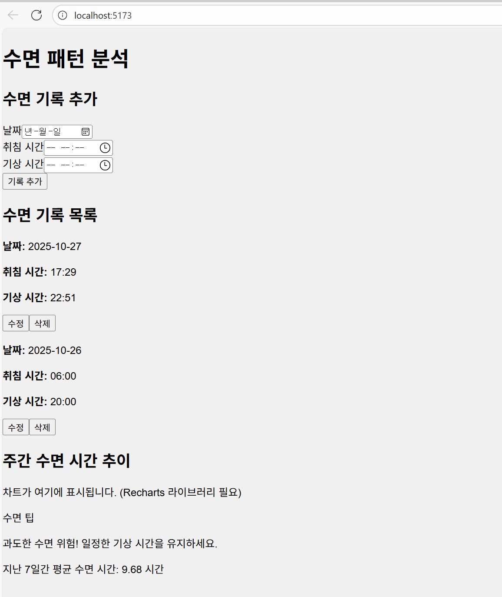

# 수면 패턴 분석 웹 애플리케이션

이 프로젝트는 사용자의 수면 기록 데이터를 분석하여 건강한 수면 습관 형성을 돕는 개인 맞춤형 대시보드를 제공하는 웹 애플리케이션입니다.

## 주요 기능

- **수면 기록 관리** : 수면 시간, 수면 질(얕은/깊음), 기상 시간 등의 데이터를 기록하고 생성(Create), 조회(Read), 수정(Update), 삭제(Delete)할 수 있는 CRUD 기능을 제공합니다.
- **수면 패턴 시각화** : 주간 및 월간 수면 패턴의 변화를 차트 형태로 시각화하여 사용자가 자신의 수면 습관을 직관적으로 파악할 수 있도록 돕습니다.
- **맞춤형 수면 개선 팁 및 알림** : 기록된 수면 데이터를 기반으로 사용자에게 개인화된 수면 개선 팁과 알림을 제공하여 건강한 수면 습관 형성을 유도합니다.

## 기술 스택

- **Frontend** : React (Vite 기반)
- **Styling** : Tailwind CSS
- **Data Storage** : LocalStorage

## 개발 과정에서의 AI 활용 방법

이 프로젝트는 Gemini CLI를 활용하여 개발되었습니다. 주요 AI 활용 내용은 다음과 같습니다 :
- **코드 생성** : 특정 기능 구현을 위한 초기 코드 스니펫 생성
- **버그 수정** : 발생한 문제점 진단 및 해결을 위한 코드 수정 제안 및 적용
- **로직 통합** : 기존 코드 베이스에 새로운 기능 로직을 통합하는 과정 지원
- **리팩토링** : 코드 품질 향상을 위한 리팩토링 제안 및 실행
- **테스트 코드 생성** : 기능의 안정성을 보장하기 위한 테스트 코드 작성

## 주요 기능 데모 화면
다음은 최종 구현된 수면 기록 및 분석 기능을 보여주는 화면입니다.

